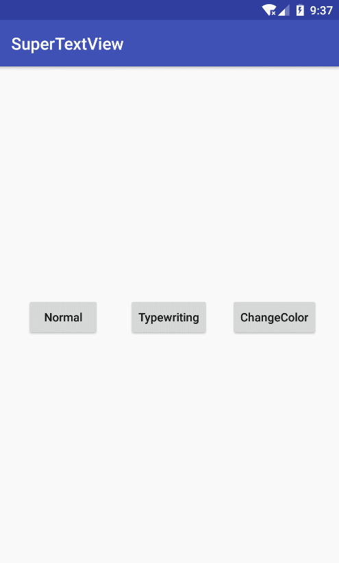

# SuperTextView
[](https://raw.githubusercontent.com/jenly1314/SuperTextView/master/app/app-release.apk)
[](https://jitpack.io/#jenly1314/SuperTextView)
[](https://opensource.org/licenses/mit-license.php)
[](http://blog.csdn.net/jenly121)

SuperTextView for Android 是一个在TextView的基础上扩展了几种动画效果的控件。

## Gif 展示


## 引入

### Maven：
```maven
<dependency>
  <groupId>com.king.view</groupId>
  <artifactId>supertextview</artifactId>
  <version>1.0.1</version>
  <type>pom</type>
</dependency>
```
### Gradle:
```gradle
compile 'com.king.view:supertextview:1.0.1'
```
### Lvy:
```lvy
<dependency org='com.king.view' name='supertextview' rev='1.0.1'>
  <artifact name='$AID' ext='pom'></artifact>
</dependency>
```

###### 如果Gradle出现compile失败的情况，可以在Project的build.gradle里面添加如下：（也可以使用上面的GitPack来complie）
```gradle
allprojects {
    repositories {
        //...
        maven { url 'https://dl.bintray.com/jenly/maven' }
    }
}
```

## 示例

布局
```Xml
<com.king.view.supertextview.SuperTextView
    android:id="@+id/superTextView"
    android:layout_width="wrap_content"
    android:layout_height="wrap_content" />
```


代码示例（核心调用代码）
```Java
//设置动画的动态监听（动画结束后回调）
superTextView.setOnDynamicListener(OnDynamicListener onDynamicListener);
//设置动画的动态风格
supertextview.setDynamicStyle(DynamicStyle dynamicStyle);
//设置动画的动态文本
supertextview.setDynamicText(CharSequence text);
//开始动画
supertextview.start();


```


## 关于我
   Name: Jenly

   Email: jenly1314@gmail.com / jenly1314@vip.qq.com

   CSDN: http://blog.csdn.net/jenly121

   Github: https://github.com/jenly1314

   微信公众号:

   
   
   加入QQ群: [20867961](http://shang.qq.com/wpa/qunwpa?idkey=8fcc6a2f88552ea44b1411582c94fd124f7bb3ec227e2a400dbbfaad3dc2f5ad)
   
   
   
